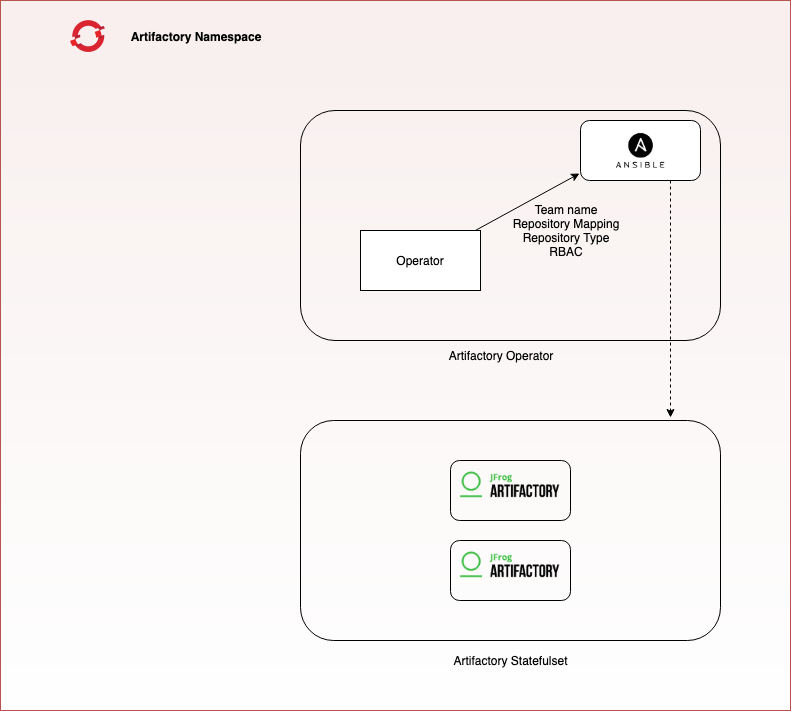
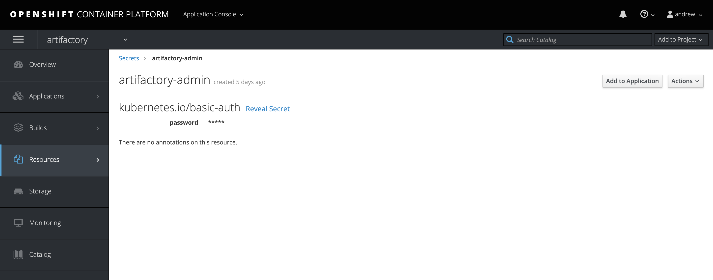

## Overview

This Ansible Operator has been written for Artifactory to handle multi-tenancy, repo creation and user permissions.

## High-level architecture

 

## Deployment

In the Artifactory deployment project, confirm that the secret `artifactory-admin` exists with a password for Artifactory. Leave Username blank.



### Operator Install automation

Follow the Operator Installation instructions in [./install/README.md](./install/README.md)

## Creating Artifactory Custom Resources

There are 2 types of Artifactory Custom resources.

### Repository Creation

> Must have cluster-role artifactory-object-admin for Artifactory Repository creation

Example ArtifactoryRepo CR (Custom Resource) exists under `config/crd/bases/tmpl-artifactory-repo.yaml`

An example env file also exists under `config/crd/bases/team-type-locator.env`

| Parameter                 | Comments                                                 | 
|---------------------------|----------------------------------------------------------|
| TEAM_NAME                 | Name of the repository                                   |
| REPO_TYPE                 | Type: docker, maven etc                                  |
| REPO_LOCATOR              | local or virtual                                         |
| REPO_DESCRIPTION          | Description of the repo                                  |
| LIST_REPOS_VIRTUAL        | If type virtual, list local repos to add to virtual repo |

Create the ArtifactoryRepo Custom Resource:

``` bash
 oc --as=system:serviceaccount:openshift:bcdevops-admin process -f ./config/samples/tmpl-artifactory-repo.yaml --param-file=./config/samples/team-type-locator.env --ignore-unknown-parameters=true | oc --as=system:serviceaccount:openshift:bcdevops-admin create -f -
 oc process -f ./config/crd/samples/tmpl-artifactory-repo.yaml --param-file=./config/samples/team-type-locator.env --ignore-unknown-parameters=true | oc create -f -
```

A repository Service Account user (and namespace secret) is created with each repository.  This service account will be named `{TEAM_NAME}-{REPO_TYPE}-{REPO_LOCATOR}`, and can be used to manage the repository access.

### Artifactory Service Account Creation

> Requires namespace editor (or admin) to create or delete the artifactorySA objects.

Example ArtifactorySA CR (Custom Resource) exists under `config/crd/bases/tmpl-artifactory-sa.yaml`

| Parameter                 | Comments                                                 |
|---------------------------|----------------------------------------------------------|
| DESCRIPTOR                | Description for the Service Account                      |

Create the ArtifactorySA Custom Resource:

``` bash
 oc process -f ./config/crd/bases/tmpl-artifactory-sa.yaml -p DESCRIPTOR="Description of Service Account" | oc create -f -
```

#### Service Account Permissions

By default, a service account will have access to the (cluster) public repositories for cached and/or cluster authenticated repository access.

To add additional access to your private repositories, you will need to add the Service Account user to your repository permissions.

see: [https://www.jfrog.com/confluence/display/JFROG/Artifactory+REST+API+V2]
