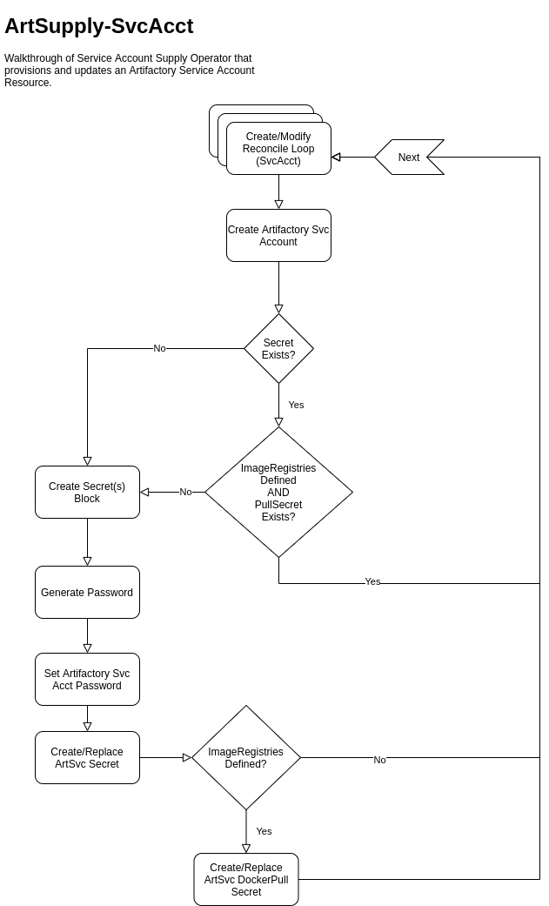

# Artifactory User Provisioning

## Summary

Artifactory access provisioning for OpenShift applications uses (local) Artifactory accounts that are provisioned using a custom Operator.  This approach allows each namespace to be configured with an appropriate Artifactory service account.

## Goals

1. Create technical documentation of the features and actions needed to support the included user stories.
2. Create User documentation to walk through the easy path for each of the included user stories

## Proposal

### User Stories

#### Access Artifactory Content in Builds

As an Application Developer, I would like to be able to use the Artifactory Service to download containers, rpms, and/or libraries to build my applications.

##### Required technical features
- [x] Artifactory has a list of commonly-used caching repos.
- [x] Docent/Archeobot has the ability to create/delete a service account and secret.
    - [x] Cluster has ArtifactoryServiceAccount CRD
    - [x] Docent/Archeobot responds to the creation of an ArtSvcAcct resource by creating an account in Artifactory with privileges on the caching repos and creating a secret in the relevant namespace with the service account's password.
    - [x] Docent/Archeobot responds to the deletion of an ArtSvcAcct resource by deleting the relevant account in Artifactory (if it exists) and the related secret in the relevant namespace.

#### Access Artifactory Content in Deployments

As an Application Developer, I would like to be able to use an artifactory container URL in my deployment manifest to run my workloads.

##### Required technical features
- [x] Artifactory has a list of commonly-used caching repos.
- [x] Docent/Archeobot has the ability to create/delete a service account and secret.
    - [x] Cluster has ArtifactoryServiceAccount CRD
    - [x] Docent/Archeobot responds to the creation of an ArtSvcAcct resource by creating an account in Artifactory with privileges on the caching repos and creating a regular secret and pull secret in the relevant namespace with the service account's password.
    - [x] Docent/Archeobot responds to the deletion of an ArtSvcAcct resource by deleting the relevant account in Artifactory (if it exists) and the related secrets in the relevant namespace.
- [x] Artifactory's docker repo URLs are set up correctly with necessary gateway and/or DNS configuration.

#### Manage Artifactory Credentials

As an Application Developer, I would like to be able to reset/recover the Artifactory Service Account access token/secret.

##### Required technical features
- [x] Artifactory has a list of commonly-used caching repos.
- [x] Docent/Archeobot has the ability to sense the deletion of the relevant secret(s) and reset the passwords.
    - [x] Cluster has ArtifactoryServiceAccount CRD
    - [ ] Docent/Archeobot responds to the deletion of an owned secret by checking to see if the relevant service account exists and, if it does, then it resets the password for it and creates a new secret (and pull secret, if necessary) with the new password.

#### Lookup Available Resources

As an Application Developer, I would like to be able to discover which repository resources are available through the Artifactory Service.  I would also like to be able to request new repositories.

##### Required technical features
- [x] Artifactory has a way to display the complete list of available repos
    - [x] cURL command is available and documented to collect this information from the Artifactory API.
- [ ] Ticket type exists in `devops-request` to request a new caching repo be added to Artifactory.

#### Provide Access from Multiple Clusters

As an Application Developer, I would like to be able to use the Artifactory service from any of the available DevExchange clusters.

##### Required technical features
- [ ] Docent/Archeobot is fully available on all clusters, connecting to the prod Artifactory instance.
    - [ ] No functionality of Docent/Archeobot requires installation on the same cluster as Artifactory.

#### Automated Provisioning
As an OPS team member, I want to enable automated default provisioning of Artifactory access with every Client ProjectSet so that managing default access to the Artifactory service is not a burden as the number of clients scales up.

##### Required technical features
- [x] Project provisioner creates a default service account for Artifactory as part of the process of setting up a new project.
    - [x] Project provisioner creates a default ArtifactoryServiceAccount resource in every tools namespace.
    - [x] Requirements of "Access Artifactory Content in Builds/Deployments" requirements are met.

#### Access Control and Audit

As an OPS team member, I would like to be able to reconcile *Artifactory Service Accounts* to a provisioning request/OCP Custom Resource.

##### Required technical features
- [x] Creation of an ArtifactoryServiceAccount resource points clearly and specifically to a single service account in Artifactory.
    - [x] Account username is recorded in the relevant secret by Docent/Archeobot.
- [ ] Any service account in Artifactory can be easily traced back to a specific namespace and ArtifactoryServiceAccount resource.
    - [ ] Namespace must be clearly recorded somewhere in the service account's metadata during account creation.
    - [x] The service account's username contains the name of the ArtifactoryServiceAccount resource.

### Implementation Details/Notes/Constraints

To consume Artifactory Services a container in a namespace requires a provisioned account in the Artifactory service, and an accessible secret containing the access token(s) for the provisioned account.

The current implementation uses a cluster-based operator (Docent/Archeobot) that provisions the Artifactory service access.  The operator creates a namespaced secret that contains the initially provisioned access token, and will create additional Docker secrets if the ArtifactorySA Custom Resource specifies docker URLs to be associated with the secret.

#### BCGov Artifactory Operator

The current version of the Docent/Archeobot Operator is able to perform the provisioning/decommission of the Artifactory service accounts and both docker and regular secrets.  The default namespace access provisioning is currently automated through the Project Registry pipeline and creates a single Artifactory Service account in the `-tools` namespace for a team.

The improvements recommended are targeted specifically at the following areas:

- Formalize the documentation for Developers to leverage the service for Builds
- Formalize the documentation for Developers to leverage the service for deployments
- Update the Operator to add [Manage Artifactory Credentials](#manage-artifactory-credentials)
- Update the Operator to add [Access Control and Audit](#access-control-and-audit)
- Update the Operator and deployments to validate [Provide Access from Multiple Clusters](#provide-access-from-multiple-clusters)

##### Known Issues and enchancements

[# 865](https://github.com/BCDevOps/developer-experience/issues/865) - Default provisioned access requires manual secret management

[# 621](https://github.com/BCDevOps/developer-experience/issues/621) - Enhancement for automated secret reset/recovery

**Proposed User Provisioning Workflow**

#### BCGov Artifactory Service

The current deployment of Artifactory as a service includes several external repositories configured for caching/pull-through.  To fit the User story [Lookup Available Resources](#lookup-available-resources) additional change process and documentation need to be defined.
