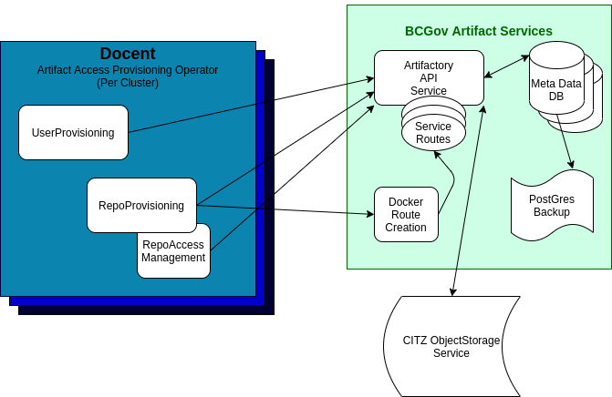

# Artifactory Repo Provisioning

## Summary

Artifactory repositories for OpenShift applications are provisioned using a custom Operator.

## Goals

1. Create technical design and documentation of the features and actions needed to support the included user stories.
2. Create User documentation to walk through the easy path for each of the included user stories

## Proposal

### User Stories

#### Create a repository that can be accessed by multiple clusters

As an Application Developer, I would like to be able to use the Artifactory Service to store containers, rpms, and/or libraries I use to build and run my applications from within my project space.

##### Required technical features
- [ ] Docent/Archeobot has the ability to create/delete a private repository.
    - [x] Cluster has ArtifactoryRepository CRD.
    - [ ] Docent/Archeobot responds to the creation of an ArtRepo resource by creating a private repository with the appropriate settings in Artifactory.
        - [ ] ArtRepo creation privileges are limited to the Platform Services team, so a ticket exists in `devops-requests` for teams to request a member of the team to create the resource on their behalf.
    - [ ] Docent/Archeobot responds to the deletion of an ArtRepo resource by deleting the private repository with the appropriate settings in Artifactory.
        - [ ] ArtRepo creation privileges are limited to the Platform Services team, so a ticket exists in `devops-requests` for teams to request a member of the team to delete the resource on their behalf.

#### Manage Repository Access

As an Application Developer, I would like to be able to manage access permissions to my Artifactory repositories from within my project space.

##### Required technical features
- [ ] Docent/Archeobot has the ability to edit a private repository's access permissions.
    - [ ] Docent/Archeobot responds to the alteration of an ArtRepo resource by checking for the nature of the change and, if it's a change to the listed permissions, adding or removing permissions on the relevant repo.
    - [ ] ArtRepo update privileges should be granted to those with admin privileges on the namespace.

#### Multiple Cluster Access

As an Application Developer, I would like to be able to access all use cases from any cluster my app is deployed to.

##### Required technical features
- [ ] Docent/Archeobot is fully available on all clusters, connecting to the prod Artifactory instance.
    - [ ] No functionality of Docent/Archeobot requires installation on the same cluster as Artifactory.

### Implementation Details/Notes/Constraints

**Initial ideas for RBAC constraints**
- Artifactory Admin's can CREATE/UPDATE/DELETE repo CRs
- namespace Admin's can UPDATE/DELETE repo CRs (future feature)
- Default owner/manager service account (if not specified in CR) is the default namespaced service account. *(Future requirement to be "Editor" instead of Owner/Manager - once operator manages push/pull access)*
- Additional Artifactory accounts added by modifying the repo CR (future feature)
  - Edit (Push artifact, pull artifact, delete artifact)
  - Read (Pull artifact)

#### BCGov Artifactory Operator

Complexity arises during Repo Provisioning.  If the *Docent* operator is running on an external cluster, provisioning the route objects becomes challenging:

- Grant access to each remote cluster to provision route manifests within the artifactory service namespace
- Create an API endpoint within the Artifactory service namespace that can provision the route objects (still need remote credentials of some sort)
- Use a single wildcard route for all docker repositories?
- Use artifacts.developer.gov.bc.ca/<DOCKER_REPOSITORY>:<DOCKER_TAG>  (removing custom subdomain routes)

#### BCGov Artifactory Service

Operational sizing, repository pruning, repository quotas and constraints need to be established with documentation provided to teams before onboarding.

#### High level design flow

