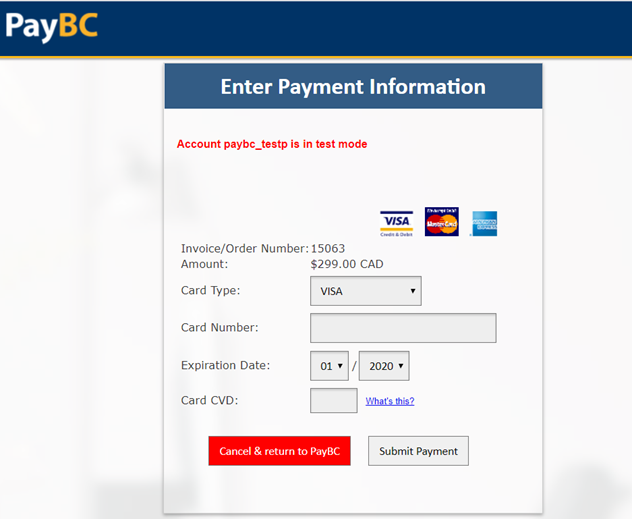
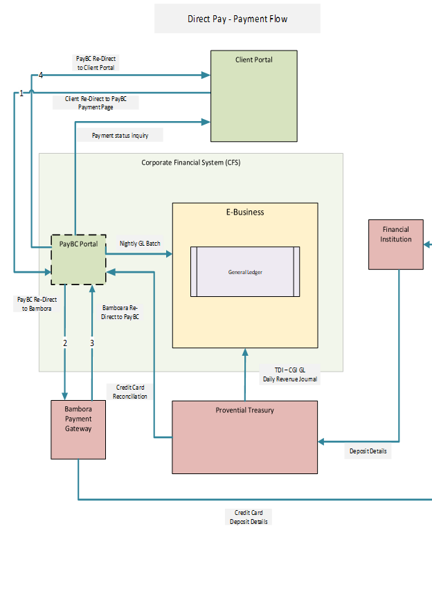

# Payment Card Processing for OpenShift Applications

For the safety of financial transactions, the Payment Card Industry Data Security Standard (PCI-DSS) exists to govern the collection and transaction of financial records. Hosting applications collecting payment within the DevOps Platform may place the entire environment within PCI-DSS scope and governance.  The DevOps Platform was never intended to be PCI-DSS compliant.  

A centralized PCI-DSS Compliant solution is under development by ServiceBC within the 2020/2021 fiscal time frame to meet demand, with PayBC complementing middle to longer term payment gateway design patterns. Ministry partners are asked to review and implement PCI-DSS compliant design patterns removing the DevOps Platform from PCI-DSS scope.

Below, we describe how credit card payments should be processed by OpenShift hosted applications through PayBC, so as not to introduce PCI-DSS requirements on the platform itself.

Alternatively, Ministries may host their own PCI-DSS proxy service for connection to the credit card processor.


# Direct sale (PayBC) - Overview

PayBC portal offers a comprehensive card payment solution where Business and Citizens can come query their Invoices (in CFS or on the onboarding partners platform), select invoice to pay, go through the checkout process, make a payment and print their receipts. Payment information is sent back to the application where receivables exists. 

Direct sale is a new offering of PayBC platform where external application can use PayBC to process a Credit card fund capture against a receivable transaction. PayBC portal stays completely transparent to the user using the onboarding partners application. All user see is the Bambora payment applet where they enter the credit card details and confirm payment. The payment information is communicated back from PayBC to the calling application. Also, if the onboarding ministry is in the BCGOV ledger, PayBC would also post the accounting in the CFS BCGOV ledger for revenue and cash. 

From a User interface perspective, the below screen is what is rendered by PayBC as part of the Client application UI flow. The remaining data exchange, functions are background processes transparent to the User.



 

 

# Context diagram



 **Payment data flow:**

1. Client application forward a user directly to the PayBC. PayBC validates the payment request and saves the transaction, associated lines along with revenue coding details in PayBC.  
2. PayBC redirect Bambora Payment Gateway where user enters Card information and confirms payment.
3. PayBC saves the Funds Capture response from Bambora within PayBC. 
4. PayBC redirects the user back to the client portal with payment response.

 

**Financial Accounting data flow:**

1. PayBC posts summarized Revenue and Cash accounting journals overnight into CFS BCGOV ledger. This offering is available on onboarding partners subscription.
2. Provincial Treasury posts the Cash Clearing Journal as part of nightly batch.


## **TECHNICAL OVERVIEW**

The direct sale allows to make payment online using PayBC when we do not have an invoice number. The calling website/portal needs to call the PayBC portal with the required request parameters. The PayBC portal validates the request and navigates the user to the Bambora checkout form where the user will enter the card information, clicks the Pay button. Once payment is complete, the PayBC portal will do post-processing and redirects the response to the calling website.

Further technical details can be found in the PayBC GitHub repository: https://github.com/bcgov/sbc-pay.


## **ARCHITECTURE**


## **SECURITY**
The PayBC portal accepts the request and uses the parameters passed in the URL of a GET request. The key/value pairs of the query string should be secured by passing a hashed string created from the query string.
    
The URL should contain the paybc reference number which will be provided the PayBC along with API key. With the provided API key, you can create MD5 hash on the request parameters and pass the hashed string with the parameters hashValue. Any parameters within the hashed string are secure and cannot be modified.


## **AUTHORIZATION**
The incoming requests for direct sale are authorized by paybc reference number and a string hashed with the API key provided the PayBC portal.


## **REQUEST**
The request can be made using GET method. The portal accepts the required parameters in the URL.
### GET Request
The parameters in the GET request as follows
### 1 trnDate
A transaction date is a required parameter and should be in yyyy-MM-dd format. It should be today’s date.
### 2 pbcRefNumber
The PayBC reference number is a unique number across the portal. It will be assigned to the onboarding ministries by the PayBC.
### 3 glDate
Gl date is a required parameter and should be in yyyy-MM-dd format. It should not be in the past.
GL Processing Logic,
    > Day End, transaction after Cut off time (4 PM) ,
           GL Date if in past to be increased by 1 day and posted next day 4 PM
    > Month End transaction after Cut off time (4 PM) ,
           GL Date if in past to be increased by 1 day and posted next day 4 PM
    > Year End transaction after Cut off time (4 PM) ,
           GL Date if in past to be increased by 1 day and posted next day 4 PM
### 4 Description
The description is a mandatory parameter and must not be greater than 100 characters.
### 5 pbcTxnNumber
The Transaction Number is a required parameter. It should be unique per PayBC reference number and should be not greater than 50 characters. Once the payment is paid/complete for a transaction number, it can not be used again to make a payment.
### 6 trnAmount
The transaction amount is a required parameter. It should be a decimal number with two digits in the fractional part and value should be greater than 0. This should be equal to sum of all revenue amount.
### 7 paymentMethod
The payment method is a required parameter. The possible values are CC for credit and VI for debit.
### 8 redirectUri
The redirect URL is a required parameter and used to redirect the response back to the
calling website.
### 9 currency
It is a required parameter. Only CAD is in scope as of now.
### 10 Revenue
It consists of three parts i.e line number, revenue amount and revenue account. The format of revenue is
    lineNumber1:revenueAccount1:revenueAmount1|
    lineNumber2:revenueAccount2:revenueAmount2|……….
    
Example: 1:039.18ACE.14691.8928.1800000.000000.0000:50.00
    
  10.1 LINENUMBER
     The line number is a required part of the revenue request parameter and its value must be numeric.
     
  10.2 REVENUE ACCOUNT
     The revenue account is a mandatory field. It should be in   
     XXX.XXXXX.XXXXX.XXXX.XXXXXXX.XXXXXX.XXXX format where x is alphanumeric only.
     
  10.3 REVENUE AMOUNT
     The revenue amount is a mandatory field. It should be a number with two decimal units.

### 11 Optional parameters
Ref1,ref2,ref3 are the optional parameters. They will be sent back in the response URL by
the portal.
### 12 hashValue
It is a required field. The hash value is calculated on the request parameters using the API key provided by the PayBC.

Hash value can be calculated as follows:

hashValue = MD5( (trnDate=2020-04-18&pbcRefNumber=10006&glDate=2020-04-18
&description=Direct
Sale&pbcTxnNumber=EZ000101&trnAmount=10.00&paymentMethod=CC&currency=CAD&red
irectUri=https://localhost:7002/index.html&revenue=1:039.18ACE.14691.8928.1800000.
000000.0000:10.00&ref1=&ref2=&ref3=) + API Key)

The final Query string will be
? trnDate=2020-04-18&pbcRefNumber=10006&glDate=2020-04-18
&description=Direct
Sale&pbcTxnNumber=EZ000101&trnAmount=10.00&paymentMethod=CC&currency=CAD&red
irectUri=https://localhost:7002/index.html&revenue=1:039.18ACE.14691.8928.1800000.
000000.0000:10.00 &ref1=&ref2=&ref3=&hashValue=
a6955be6fa57ea42537cb79eaefb08b0.

### 13 Example
```
https://paydev.gov.bc.ca/public/directsale?
trnDate=2020-04-18
&pbcRefNumber=10006
&glDate=2020-04-18
&description=Direct Sale
&pbcTxnNumber=EZ000101
&trnAmount=100.00
&paymentMethod=CC
&currency=CAD
&redirectUri=https://localhost:7002/index.html
&revenue=1:039.18ACE.14691.8928.1800000.000000.0000:75.00|2:039.18ACE.14692.8
928.1800000.000000.0000:25.00
&ref1=
&ref2=
&ref3=
&hashValue=a6955be6fa57ea42537cb79eaefb08b0
```


## **VALIDATION**
The request parameters will be validated once request is received by the portal. If there is a validation error, the request will be redirect to the url passed in the redirectUri request parameter along with error messages. The redirect url wil provide hash value for authentication similar to input redirect url.
### Example
```
https://redirectUri?
?trnApproved=0
&pbcTxnNumber= EZ000101
&messageText=Validation Errors
&trnDate=Date should be todays date
&pbcRefNumber=A value is required
&glDate=A value is required
&description=A value is required
&trnAmount=A value is required
&paymentMethod=A value is required
&currency=A value is required
&revenue=A value is required
&hashValue= a6955be6fa57ea42537cb79eaefb08b0.
```


## **REPONSE**
The redirect url wil provide hash value for authentication similar to input redirect url.
### 1 APPROVED TRANSACTION
```
https://redirectUri?
trnApproved=1
&trnOrderId=45678
&messageText=Approved
&trnAmount=50.00
&trnDate=2019-07-17
&cardType=VI
&paymentMethod=CC
&pbcTxnNumber=EZ000101
&paymentAuthCode=04066N
&ref1=
&ref2=
&ref3=
&hashValue= a6955be6fa57ea42537cb79eaefb08b0
```


### 2 DECLINED TRANSACTION
```
https://redirectUri?
trnApproved=0
&trnOrderId=45678
&messageText=Declined
&trnAmount=50.00
&trnDate=2019-07-17
&cardType=VI
&paymentMethod=CC
&pbcTxnNumber=EZ000101
&paymentAuthCode=null
&ref1=
&ref2=
&ref3=
&hashValue= a6955be6fa57ea42537cb79eaefb08b0.
```


## **QUERY GET WEB SERVICE**
GET webservice endpoint will be provided from PayBC to get transaction status and details for completed transaction, Query web service will be hosted on a separate server and port from PayBC and AR CFS web service and will be oauth2 authenticated with a separate client id and secret.

<u>GET Url pattern</u>
https://servername:port/ords/cas/paybc/payment/<paybc ref no>/<transaction no>

e.g
https://servername:port/ords/cas/paybc/payment/10006/EZ000101

<u>Reponse</u>
If No data in PayBC
     404 Not Found, if Data is not found

If data in PayBC
PNDNG = Pending means no payment was made
PAID = Successful payment was received
CMPLT = Successful payment was received and GL was posted to CFS

NEW = Revenue Record Created in CFS
REJECT = CFS GL post failed, GLErrorMessage will have details
IN PROCESS= CFS GL Process in progress.
PROCESSED = CFS GL post successful

```
{
   "pbcRefNumber ":"10006",
   "pbcTxnNumber":"EZ000101",
   "trnDate":"2020-04-18",
   "description":"Direct Sale",
   "trnAmount":"100.00",
   "paymentMethod":"CC",
   "currency":"CAD",
   "glDate":"2020-04-18",
   "paymentStatus":"PNDNG/PAID/CMPLT",
   "trnOrderId":" 45678",
   "paymentAuthCode":" 04066N",
   "cardType":" VI",
   "revenue":[
      {
         "lineNumber":" 1",
         "revenueAccount":"039.18ACE.14691.8928.1800000.000000.0000",
         "revenueAmount":"75.00",
         "glStatus":"NEW/IN PROCESS/REJECT/PROCESSED ",
         "glErrorMessage":"Invalid revenue account"
      },
      {
         "lineNumber":" 2",
         "revenueAccount":"039.18ACE.14692.8928.1800000.000000.0000",
         "revenueAmount":"25.00",
         "glStatus":"NEW/IN PROCESS/REJECT/PROCESSED ",
         "glErrorMessage":"Invalid revenue account"
      }
   ]
}
```


## **POST WEB SERVICE**
POST webservice endpoint will be provided from PayBC to update the revenue for paid transaction.
Revenue can only be updated for PAID Transactions and if GL status is NEW/REJECT POST Url pattern.
https://servername:port/ords/cas/paybc/payment/<paybc ref no>/<transaction no>
e.g
https://servername:port/ords/cas/paybc/payment/10006/EZ000101

```
{
   "revenue":[
      {
         "lineNumber":" 1",
         "revenueAccount":"039.18ACE.14691.8928.1800000.000000.0000",
         "revenueAmount":"75.00"
      },
      {
         "lineNumber":" 2",
         "revenueAccount":"039.18ACE.14692.8928.1800000.000000.0000",
         "revenueAmount":"25.00"
      }
   ]
}
```


