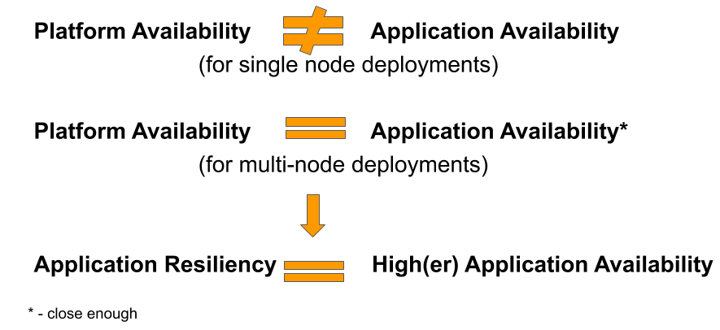

# Resiliency Guidelines

One of the most amazing benefits of working on the Openshift Platform is that, when your application has been designed with a few key ideas in mind, you can avoid many of the regular outages that are almost unavoidable on legacy infrastructure.
All that time you used to spend with your application down because you needed to patch a server? Gone.
If a node needs to go down for patching purposes, a correctly designed application can simply spin up another pod on another node, and your users won't even notice.
Sounds great, right? But the question is, then: how do you design an application for Openshift if it's so different from applications designed for legacy infrastructure?

## What does "Correctly Designed" mean?

All you need to do is make sure that your application takes advantage of this through some specific design requirements. These are outlined through the concept of a *[12 Factor App](https://12factor.net/)*.
Of course, this is a technical outline for technical users - here's a bit more of an accessible list of what it means to have a resilient app!

**Note: If you're a technical user looking for some help on how to make a 12-factor app happen, skip to the bottom of this document for examples of applications that run in a resilient manner on our platform already, and feel free to ask those teams for some advice on how they got there!**

### A Monitored App

A app that runs without failing most of the time is great, but things happen. Maintenance, failures, network problems, and sneaky little issues in the design or implementation of your app can cause strange behaviours or outages.
Our platform is extremely highly available, (99.99% available as of mid-2020!) but that doesn't mean you should assume that your application is guaranteed the same - application outages can happen for reasons other than full platform outages.

The best way to keep on top of these issues in a proactive manner is to monitor your application and ensure that there are appropriate notifications of issues. There are tons of ways that such a monitoring can be implemented:

* pod health checks
* uptime dashboards
* API health checks
* storage health checks
* and more!

Many of these notification options provide your team an opportunity to act to prevent an outage before one even starts - finding out, for example, that your storage is almost full _before_ it fills up means that your team can act to deal with the storage issue _before_ it causes an outage or service issue.
Still others let you know the moment an outage starts and can provide extremely valuable information about the cause of the outage, so your team can begin troubleshooting right away without having to wait for users to inform you of the problem.

Your team should also ensure you are in the [#devops-alerts](https://chat.pathfinder.gov.bc.ca/channel/devops-alerts) channel in RocketChat where notices of upcoming maintenance are posted. The channel is quite low volume, so it may be worth turning up your RocketChat notification settings for the channel to **All messages**.

### A Highly Available App

Our platform may have _very_ high availability in general, but our individual _nodes_ do not. This doesn't mean the nodes are unstable or difficult to use - it just means that the way we approach maintenance and infrastructure problems are a little different from the way things work in the legacy application world.
Did you know that we don't guarantee a single node will be up for more than 24 hours at a time? That's right - our nodes *will* be restarted or changed very often!
This might sound like a big problem with the platform, but it's actually a feature; it means that the platform team can be _extremely_ proactive about keeping the platform's physical infrastructure in great shape.

Legacy infrastructure is designed to ensure that a specific server will have the highest possible uptime. Clearly, the Openshift Platform works a little differently - instead, we ensure that you will always have _some_ infrastructure to use for your application, but not that the infrastructure will be the same, or that it will remain up forever.
Now that your team is aware of that, it's simply a matter of architecting your application accordingly.

There are plenty of options for ensuring that this change in approach helps your application stay up even longer than it might on legacy infrastructure.
After all, your application's ability to jump in an agile manner from one node to the next means that you don't have to endure maintenance outages.
If one node goes down for maintenance, your application can simply spin up on another.
Or, even better, if your application is _already_ running on multiple nodes, taking down one node has no impact at all!

### An Easily Deployable App

Because all applications on OpenShift should be architected with the expectation that any node can go down at any time, it's imperative that applications be easy and quick to redeploy, requiring - most importantly - **no human interaction in the process**.
Once the platform is given the command to deploy your software on a new pod, the process between starting up that new pod and having an accessible and useable app should require no human interference whatsoever.

This means that all of your deployment configuration should be automated and kept in source-control to ensure that it is easily accessible, consistent, and up-to-date at all times!
And that includes any side processes like your monitoring tasks from point 1!

### A Recoverable App

This part isn't so different from legacy applications after all - if you need to recover your app due to data corruption or some other significant failure, it's important that your application be architected to do so quickly and easily.
Most of this is covered by having an application that is easily deployable, but it's also important that you have the ability to recover anything stateful data and configuration that cannot be held in a repository. In other words, you need to be able to recover your database and application passwords.

### A Correctly Resourced App

Ensuring your application has the resources it needs, while not hogging too much is a balancing act. Different apps and environments will also need different levels of service.

Pods can define [compute resources](https://docs.openshift.com/container-platform/3.11/dev_guide/compute_resources.html#dev-compute-resources) via Requests and Limits for CPU and Memory. A Request is a guaranteed amount dedicated exclusively to your pod. A Limit is a maximum you cannot exceed. As Requests are dedicated and the amount of CPU cores and RAM in the cluster is limited please be sparing with your use. If the cluster becomes full additional pods will simply fail to start.

It is preferable to scale horizontally than vertically. Use smaller Request and Limit values for CPU and Memory and use a [Horizontal Pod Autoscaler](https://docs.openshift.com/container-platform/3.11/dev_guide/pod_autoscaling.html) to scale up the number of pods to meet demand.

Make use of the [Quality of Service](https://docs.openshift.com/container-platform/3.11/dev_guide/compute_resources.html#quality-of-service-tiers) options available to ensure your pods are correctly resourced and treated appropriately by the scheduler.

If your pod has its Requests and Limits set to `0` it will run BestEffort and simply use whatever spare capacity is available on its node. This can be good for things like batch jobs that want to go as fast as they can, but don't care about being slowed down from time to time. It will also be the first to be evicted from an overloaded node. Assigning `0` as a request or limit must be done through the CLI or directly in the manifest. 

If your pod has Limits higher than its Requests it will run Burstable and get at minimum the Requested amount and by burst up to its Limit depending on how busy the node is with other pods.

If your pod has the Requests and Limits set to the same value then it will run Guaranteed QoS class. It will have preferential access to compute resources and will be the last to be evicted if a node should become overloaded. This is best for apps in the `prod` namespace as they need the best uptime.

## Community Support

You may note that this document is pretty vague about the "hows" of these principles. This is because it can vary from application to application, and technology stack to technology stack.
The design needs for a highly available chat application are very different from those of a highly available static website.

If you're looking for some general guidance on what high availability options exist in Openshift, our [Openshift 101](https://developer.gov.bc.ca/ExchangeLab-Course:-Openshift-101) course offering covers a number of options, including how to deploy a basic application with high availability.

This is where the community comes in - if you have a highly available application, please feel free to fork this document and add links to examples from your application (along with information about your stack and any explanations you feel might be necessary).
The more you reach out to help your fellow developer, the stronger a community we will be!

And it's very important to remember that we in the BC Government are part of a larger, international community of developers working to create better and more resilient applications.
There are a lot of great resources available on the broader internet that we could never hope to match on our own.

### Tools

The Developer Exchange community is full of great developers seeking ways to help the rest of the community - here are some examples of tools that you can use to help build a more resilient application!

**[BCDevOps/backup-container](https://github.com/BCDevOps/backup-container)**

- Features a separate container that can spin up on a schedule in your namespace which connects to your database to perform a backup and/or to perform a test recovery of the most recent backup.
- Currently works for both Postgres and MongoDB

**[BCDevOps/Platform-Services/Patroni](https://github.com/BCDevOps/platform-services/tree/master/apps/pgsql/patroni)**

- An open-source option for creating a highly available Postgres cluster

### Examples

The following are some fantastic examples of applications that operate on the platform with high resiliency design, as well as a couple of quick summaries of how and why they made the decisions they did.
If you're aiming to build something similar to an app here, please always feel free to ask the team in question for their advice on how to make your application more resilient as well!

**While these examples all include resilient design, they're not going to be perfect for everyone! Use them as starting points for your making your own decisions about the best architecture for your application, not as gospel for how you are "supposed" to do things!
And if you have an idea for how any of these projects might improve, offer your idea (and maybe even a helping hand)!**

**[Rocketchat](https://github.com/BCDevOps/platform-services/tree/master/apps/rocketchat)** - Platform Team

- A highly available implementation of Rocketchat with an autoscaler that can change the total number of pods from a minimum of 3 to a maximum of 5, based on CPU usage.
- A highly available implementation of a MongoDB stateful set.
- Pod anti-affinity ensures that no two pods are ever spun up on the same node.
- MongoDB backups are currently performed using a straightforward cronjob that spins up a pod to connect to the database and perform the backup.

**[Keycloak](https://github.com/bcgov/ocp-sso)** - Platform Team

- A highly available implementation of Keycloak
- An example of how to implement Patroni (in the future, this will become an example of highly-available EDB instead)

**[Devhub](https://github.com/bcgov/devhub-app-web)** - Developer Experience
- 3 replica Deployment
- a chain-build gastby (react app) that builds nodejs into a caddy server

**If your team has a resilient design of any kind - even if you haven't perfected it - please fork this document and add your repo as an example! Nobody is perfect, and in-progress examples are a great help for teams trying to learn where to start!**
