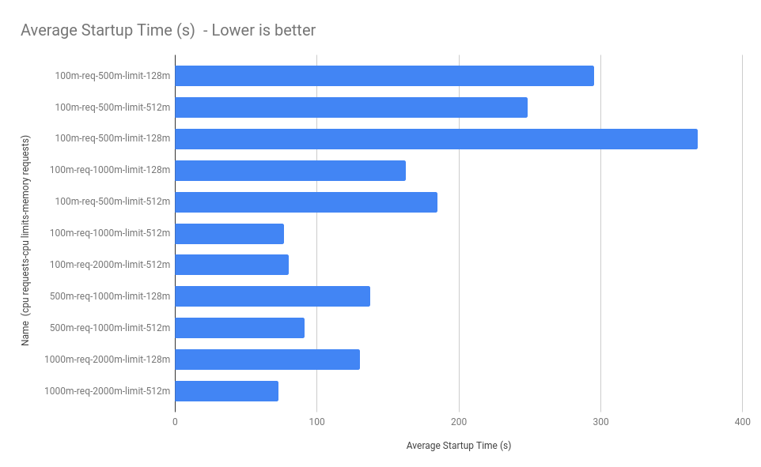
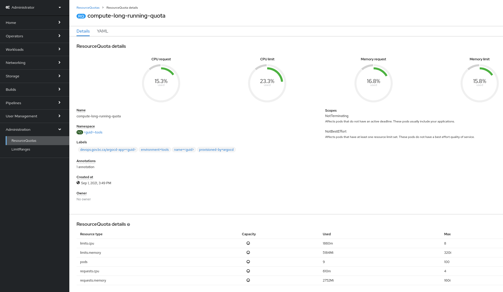

# Application Resource Tuning

As touched upon in the [Resiliency Guidelines](https://developer.gov.bc.ca/Resiliency-Guidelines#a-correctly-resourced-app), deploying applications with appropriate CPU and Memory [*Requests and Limits*](https://docs.openshift.com/container-platform/3.11/admin_guide/overcommit.html#requests-and-limits) is critical to ensure:

- Resource availability for your own applications
- Resource availability for other tenant applications

While [*Resource Quotas*](https://docs.openshift.com/container-platform/3.11/dev_guide/compute_resources.html#dev-quotas) are quite generous, these quotas must be seen as a tool to allow tenants enough resources to temporarily burst usage for experimentation, rather than an upper limit of consistent use. The platform is not sized to support every tenant fully utilizing their *Resource Quota*.

**Resource Requests**  
Resource requests are guaranteed and reserved for the pod. *Scheduling decisions are made based on the request* to ensure that a node has enough capacity available to meet the requested value.

**Resource Limits**  
Resource limits set an upper limit of what a pod can burst to if the resources are available on the node.

## Setting Requests and Limits

:exclamation: **If you set a resource Limit, you should also set a resource Request.** Otherwise the Request will match the Limit. For example, a Deployment with *no* defined CPU request and a defined CPU limit of 1 core will *result in a pod with a request of 1 CPU and a limit of 1 CPU*.

**General Guidelines**\
:ballot_box_with_check: Set requests and limits.\
:ballot_box_with_check: Set requests to the *minimum* of what your application needs.\
:ballot_box_with_check: Set limits to a reasonable burstable number of what a single pod should support.\
:ballot_box_with_check: Use horizontal pod autoscalers where possible, rather than large CPU and memory limits.

**Being A Good Resource Citizen**

:star: :star: :star:

Having a **3:1 ratio** of CPU Limit:CPU Request is a good starting place for new applications that haven't yet been tuned. Using a 3:1 ratio makes you a **good community member**!

:star: :star: :star: :star:

Having a **2:1 ratio** of CPU Limit:CPU Request is a great next step for teams whose projects are working and stable, and who are in a position to start tuning their application more effectively - especially those who are seeking to make better use of horizontal scaling.
Using a 2:1 ratio makes you a **great community member**!

:star: :star: :star: :star: :star:

Having a **1.5:1 ratio** of CPU Limit:CPU Request is an amazing goal for teams who have already started tuning their applications and are looking to make the best possible use of the platform's capabilities. Using a 1.5:1 ratio makes you an **amazing community member**!

### CPU and Memory Utilization

Here is an awesome 4 min video that includes an example of resource tuning for a sample Openshift application.

<https://youtu.be/rkxVZgn9icU>

### Resource FAQ's

**Q: What happens if I don't specify a limit or a request?**  
A: Your pods will be deployed with the following defaults:

- CPU Request: 100m
- CPU Limit: 250m
- Memory Request: 256Mi
- Memory Limit: 1Gi

This is the NOT same as specifying a resource request or limit of 0.

**Q: What happens if I set the request and limits to 0?**  
A: Your pods will run under the BestEffort QoS class, using whatever spare capacity is available on the node.

:small_red_triangle: Assigning `0` as a request or limit must be done through the CLI or directly in the manifest. The Web Console will not accept `0` as a request or limit while editing the resources on a Deployment; it will apply the platform defaults outlined in the previous answer.

**Q: What happens if I create a deployment and only specify a limit?**  
A: Your Pods will be deployed with a Request that is identical to the Limit.

**Q: What happens if I create a deployment and only specify a request?**  
A: Your Pods will be deployed with the configured request, and will have the default limit applied of:

- CPU Limit: 250m
- Memory Limit: 1Gi

**Q: What happens if I create a deployment with a request that is higher than the default limit?**  
A: You will be required to define a limit.

**Q: Is there any way I can check for myself the actual CPU consumption of running pods in my project?"**
A: There is a way that requires you to make use of the `oc` client versus using the web console. Additional math will be required past this point as there is no way of automating this in a cross-platform fashion using just `oc`.

```bash
oc adm top pod
NAME              CPU(cores)   MEMORY(bytes)
<redacted>        3m           285Mi
<redacted>        3m           299Mi
<redacted>        3m           285Mi
<redacted>        0m           13Mi
<redacted>        9m           61Mi
<redacted>        4m           98Mi
<redacted>        0m           28Mi
<redacted>        2            26Mi
```

For the above, the column of numbers involving `CPU(cores)` is what you want to add up. the `m` suffix stands for millicores, so for the above, add up the numbers and divide by 1000 to get the actual consumption of CPU cores by the pods in the current project. If the CPU usage has no `m` suffix, then that is just measured in cores, and not millicores. For the above example, the total would then be 2 + (3+3+3+9+4)/1000 = 2.022 CPU cores of actual CPU consumption.

**Q: Is there an easy way to use `oc` to get the current value of CPU Requests allowed for the project currently logged into with `oc`?
A: Certainly. The following one-liner will display the current value of CPU requests as currently allotted for the current project.

```bash
oc get quota compute-long-running-quota -o=custom-columns=Requests:.status.used."requests\.cpu"
```

Example output of the above, the `m` at the end again means millicores, so dividing the number by 1000 tells us the current project per this example has a total allotted CPU Requests value of 14.5 CPU cores.

```bash
Requests
14500m
```

## Jenkins Resource Configuration Recommendations

Tuning the resources of Jenkins deployments can have a large effect on the available resources of the platform. As of writing, Jenkins accounts for the largest user of CPU Requests and Limits on the platform. Recent analysis has indicated:

- **15-25% of CPU Requests** on the platform are related to Jenkins
- **7% of the CPU Requests** are actually used, on average, over 1 day
- **10% or More CPU Requests** for the overall platform can be saved by tuning Jenkins resources

### Recommended Configuration

Based on the performance testing details below, the following recommendations are suggested for Jenkins deployments:

- CPU Request: 100m
- CPU Limit: 1000m (May vary depending on usage)
- Memory Request: 512M
- Memory Limit: 1-2GB (May vary depending on usage)

On a typical Jenkins deployment, the following snippet could be used if you are editing the yaml:

```YAML
        resources:
          requests:  
            cpu: "100m"
            memory: "128Mi"
          limits:
            cpu: "1"
            memory: "512Mi"
```

The following command can also be used to update a Jenkins DeploymentConfig:

```bash
oc patch dc/jenkins -p '{"spec": {"template": {"spec": {"containers":[{"name":"jenkins", "resources":{"requests": {"cpu":"100m", "memory":"128Mi"}, "limits": {"cpu":"1", "memory":"512Mi"}}}]}}}}'
```

### Performance Testing Details

The reason that Jenkins is often deployed with such high CPU and Memory Requests was related to previous scheduler issues that have since been fixed on the platform. As a result, the templates **and existing Jenkins deployments** should be tuned to reduce the CPU requests.

A test was performed to collect the startup time of Jenkins under various resource configurations. Each test was performed 3 times and the startup time was averaged out across each iteration. The name of each test is in the format of `[cpu_requests_in_millicores]-[cpu_limits_in_millicores]-[memory_requests_in_mb]`.



| Test Name                  | Average Startup Time (s) |
|----------------------------|--------------------------|
| 100m-req-500m-limit-128m   |                      295 |
| 100m-req-500m-limit-512m   |                      248 |
| 100m-req-500m-limit-128m   |                      368 |
| 100m-req-1000m-limit-128m  |                      163 |
| 100m-req-500m-limit-512m   |                      185 |
| 100m-req-1000m-limit-512m  |                       77 |
| 100m-req-2000m-limit-512m  |                       80 |
| 500m-req-1000m-limit-128m  |                      137 |
| 500m-req-1000m-limit-512m  |                       91 |
| 1000m-req-2000m-limit-128m |                      131 |
| 1000m-req-2000m-limit-512m |                       73 |

The observations from the testing can be summarized as follows:

- CPU Limit has the largest effect on Startup Performance
- CPU Request has little effect on Startup Performance
- The gain from a CPU Limit of 500m to 1000m is major
- The gain from a CPU Limit of 1000m to 2000m is minor
- One ideal configuration looks like this:
  - CPU Request: 100m
  - CPU Limit: 1000m+
  - Memory Request: 512M
  - Memory Limit: 1-2GB (May vary depending on usage)

## Tools Namespaces Resource Quota Recommendations

Every product in a cluster is provided a GUID and a namespace for each environment (i.e., dev, test, prod). These products also have a **tools** namespace defined as `<guid>-tools`, where tooling such as Jenkins are deployed in.

As of writing, there is a discrepancy between compute resources (especially CPU) requested compared to actual usage.

Jenkins instances in tools namespaces across the cluster are requesting much more resources than they are utilizing on average. These overcommitted Jenkins instances are one of the largest contributors to this over-allocation problem.

In short, the recommendation is to lower compute resource requests and leverage resource limits in a burstable fashion.

This section identifies the problem and mitigation recommendation of resource over-allocation in tools namespaces.

### Decoupling Tools Namespaces Quotas and Limit Ranges

Currently, all namespaces provided to a product in a cluster are assigned the same T-shirt-sized resource quotas and limit ranges.

It is recommended to decouple the quotas and limits sizing of the tools namespace from the other environment namespaces (i.e., dev, test, prod) to adjust the only the quotas and limits of the tools namespaces separately.

###


### Viewing Quota Usage

You can identify current resource quota consumption and properly size resource requests and limits of existing/new workloads using either the OpenShift web console or `oc` command-line tool.

#### Viewing Quota Usage (GUI)

From the OpenShift web console, in the **Administrator** perspective, proceed to **Administration** > **ResourceQuotas** and select the appropriate `ResourceQuota` (i.e., `compute-long-running-quota`). Here is an example:



#### Viewing Quota Usage (CLI)

To describe a specific quota, use the `oc` tool:

```bash
$ oc describe resourcequotas compute-long-running-quota # -n <project>
Name:       compute-long-running-quota
Namespace:  <guid>-tools
Scopes:     NotBestEffort, NotTerminating
 * Matches all pods that have at least one resource requirement set. These pods have a burstable or guaranteed quality of service.
 * Matches all pods that do not have an active deadline. These pods usually include long running pods whose container command is not expected to terminate.
Resource         Used    Hard
--------         ----    ----
limits.cpu       1860m   8
limits.memory    5184Mi  32Gi
pods             9       100
requests.cpu     610m    4
requests.memory  2752Mi  16Gi
```

### Risks Reducing Resource Reservation

Consider these risks when reducing resource quotas (and subsequently, requests/limits).

See [Configuring your cluster to place pods on overcommitted nodes](https://docs.openshift.com/container-platform/latest/nodes/clusters/nodes-cluster-overcommit.html) for more details.

#### Simultaneous Resource Claiming

Reducing resource requests ["works on the assumption that not all the pods will claim all of their usable resources at the same time"](https://cloud.redhat.com/blog/full-cluster-part-2-protecting-nodes).

Consideration must be made to determine if several workloads across the cluster would be bursting above their requests, simultaneously at a specific time of day.

#### Node CPU Saturation

Very low CPU requests (i.e., 5m) may be assigned to workloads such as Jenkins that have minuscule CPU usage when idle, and rely on CPU limits to burst during pipeline runs. A potential risk with this configuration is if the node a workload is scheduled on is being heavily utilized, the workload will not be able to burst much higher than the given CPU requests, potentially causing significant slowdown.

However, this will not cause pod evictions, and CPU throttling (extensively below CPU limits) can be mitigated ensuring nodes across the cluster are evenly balanced and not overutilized.

#### Node Memory Saturation

Nodes running out of memory can be more troublesome than CPU saturation. Regardless of node capacity, workloads that consume beyond their configured memory limits will immediately be terminated. However, if the workload is above its memory requests (but within its memory limits) and its node is running out of memory, the workload may be evicted (depending on the scheduler and priority) to reclaim that memory.

Because memory is incompressible, memory requests and limits should be a little more generous to mitigate pod eviction/termination.
